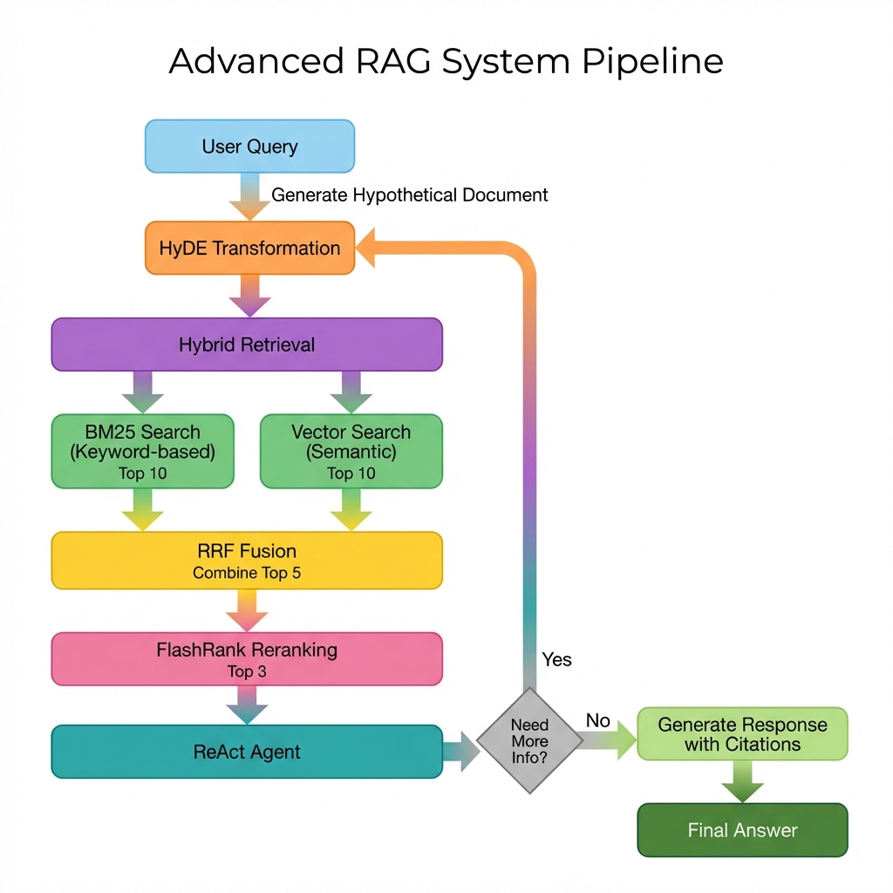

# Module 2: Advanced RAG System - Presentation Guide

## 🎯 Tổng Quan Hệ Thống

### Mục Tiêu
Nâng cấp hệ thống RAG từ **Naive RAG** (Module 1) lên **Advanced RAG** (Module 2) với khả năng truy xuất thông tin chính xác và hiệu quả hơn.

---

## 📊 Workflow Diagram

### Advanced RAG System Pipeline



**Các bước trong pipeline:**

1. **User Query** 🔵
   - Câu hỏi từ người dùng về chính sách FPT

2. **HyDE Transformation** 🟠
   - Chuyển đổi câu hỏi thành "tài liệu giả định"
   - Cải thiện độ chính xác khi tìm kiếm

3. **Hybrid Retrieval** 🟣
   - **BM25 Search**: Tìm kiếm theo từ khóa (Top 10)
   - **Vector Search**: Tìm kiếm theo ngữ nghĩa (Top 10)

4. **RRF Fusion** 🟡
   - Kết hợp kết quả từ 2 phương pháp
   - Sử dụng Reciprocal Rank Fusion
   - Chọn Top 5 documents

5. **FlashRank Reranking** 🩷
   - Sắp xếp lại theo độ liên quan
   - Chọn Top 3 documents tốt nhất

6. **ReAct Agent** 🔷
   - Agent suy luận và quyết định
   - Có thể gọi tool nhiều lần nếu cần

7. **Final Answer** 🟢
   - Câu trả lời với trích dẫn nguồn
   - Gồm: Source file + Page number

---

## 🆚 So Sánh Module 1 vs Module 2

| Tính Năng | Module 1 (Naive RAG) | Module 2 (Advanced RAG) |
|-----------|---------------------|------------------------|
| **Chunking** | RecursiveCharacterTextSplitter<br/>Fixed-size (1000 chars) | SemanticChunker<br/>Intelligent breakpoints |
| **Query Enhancement** | ❌ None | ✅ HyDE transformation |
| **Search Method** | Vector only | ✅ BM25 + Vector (Hybrid) |
| **Fusion** | ❌ None | ✅ RRF (Reciprocal Rank Fusion) |
| **Reranking** | ❌ None | ✅ FlashRank |
| **Documents Retrieved** | 3 | 10+10 → 5 → 3 (Multi-stage) |
| **Debug Logs** | ❌ None | ✅ All stages logged |
| **LangChain Version** | Any | v1.0+ |

---

## 🏗️ System Architecture

### Components chính:

#### 1. Data Processing Layer
```
PDF Documents
    ↓
Semantic Chunker (LangChain Experimental)
    ↓
Intelligent Chunks with Metadata
```

#### 2. Retrieval Pipeline
```
User Query
    ↓
HyDE Transformer (GPT-4o-mini)
    ↓
Hypothetical Document
    ↓
┌─────────────────┬─────────────────┐
│   BM25 Search   │  Vector Search  │
│   (rank-bm25)   │     (FAISS)     │
│    Top 10       │     Top 10      │
└─────────────────┴─────────────────┘
    ↓
RRF Fusion (Top 5)
    ↓
FlashRank Reranking (Top 3)
```

#### 3. Agent Layer
```
ReAct Agent (LangChain + GPT-4o-mini)
    ↓
Advanced Retrieval Tool
    ↓
Response with Citations
```

---

## 🐛 Debug Logging System

Mọi truy vấn đều tạo ra **4 file log** trong `debug_logs/`:

### 1. `chunks_TIMESTAMP.txt`
```
- Tổng số chunks
- Source file + Page number
- Content preview (500 chars)
```

### 2. `hyde_TIMESTAMP.txt`
```
- Original Query: "What is FPT's data protection policy?"
- Hypothetical Document: "FPT is committed to..."
```

### 3. `hybrid_retrieval_TIMESTAMP.txt`
```
- BM25 Results (Top 10)
- Vector Results (Top 10)
- RRF Fused Results (Top 5) with scores
```

### 4. `rerank_TIMESTAMP.txt`
```
- Before Reranking (5 docs với RRF scores)
- After Reranking (3 docs với rerank scores)
- Score comparison
```

---

## 🎨 User Interface

### Streamlit Web App với:

- **Gradient Design**: Purple theme (667eea → 764ba2)
- **Interactive Workflow**: Expandable Mermaid diagram
- **Chat Interface**: Message history + Real-time responses
- **Status Indicators**: Agent ready/not initialized
- **Citation Support**: Automatic [Source: file, Page: n]

### Chạy ứng dụng:
```bash
cd "Module 2"
conda activate agent_env
streamlit run app.py
```

---

## 📈 Key Metrics & Improvements

### Độ chính xác cải thiện:
- **Hybrid Search**: Kết hợp keyword + semantic
- **Multi-stage Filtering**: 20 → 5 → 3 documents
- **Reranking**: Relevance-based scoring

### Khả năng debug:
- **Full transparency**: Xem toàn bộ quá trình retrieval
- **Timestamped logs**: Dễ dàng theo dõi
- **Stage-by-stage**: Hiểu rõ từng bước

### Developer Experience:
- **Modular Design**: Mỗi component riêng biệt
- **Easy to modify**: Thay đổi parameters dễ dàng
- **Well documented**: README + Comments đầy đủ

---

## 🚀 Demo Flow

### Ví dụ câu hỏi:
**"What is FPT's policy on personal data protection?"**

### System xử lý:

1. **HyDE** tạo document:
   ```
   "FPT's Personal Data Protection Regulation establishes 
   comprehensive guidelines for handling sensitive information..."
   ```

2. **BM25** tìm keywords: "personal data", "protection", "policy"
3. **Vector** tìm semantic similarity với hypothetical doc
4. **RRF** merge và rank top 5
5. **FlashRank** chọn 3 docs liên quan nhất
6. **Agent** tổng hợp và trả lời:
   ```
   "Theo quy định bảo vệ dữ liệu cá nhân của FPT...
   [Source: Regulation_Personal-Data-Protection.pdf, Page: 3]"
   ```

---

## 🔧 Technologies Stack

- **LangChain 1.0+**: Framework chính
- **LangGraph**: Agent orchestration
- **OpenAI GPT-4o-mini**: LLM
- **FAISS**: Vector similarity search
- **rank-bm25**: Keyword search
- **FlashRank**: Reranking (no API key!)
- **Streamlit**: Web UI
- **Python 3.13**: Runtime

---

## 💡 Lessons Learned

### Challenges:
1. Semantic chunking requires tuning (percentile threshold)
2. RRF constant (k=60) affects fusion quality
3. Balance between BM25 vs Vector weights

### Best Practices:
1. Log everything for debugging
2. Multi-stage retrieval > Single-stage
3. Query enhancement (HyDE) significantly helps
4. Reranking is crucial for final quality

---

## 🎯 Next Steps / Future Improvements

1. **Query Classification**: Route different query types
2. **Ensemble Reranking**: Multiple rerankers
3. **Adaptive Retrieval**: Dynamic k based on query complexity
4. **Caching**: Cache embeddings & results
5. **Evaluation Metrics**: RAGAS, Faithfulness scores
6. **Multi-modal**: Add image/table extraction

---

## 📞 Q&A

**Prepared to answer:**
- Why HyDE over direct query?
- Why hybrid over vector-only?
- FlashRank vs other rerankers?
- Debug logs overhead?
- Production deployment considerations?

---

*Created for FPT Intern AI Roadmap - Module 2*
*Advanced RAG System with Semantic Chunking, HyDE, Hybrid Search, and Reranking*
